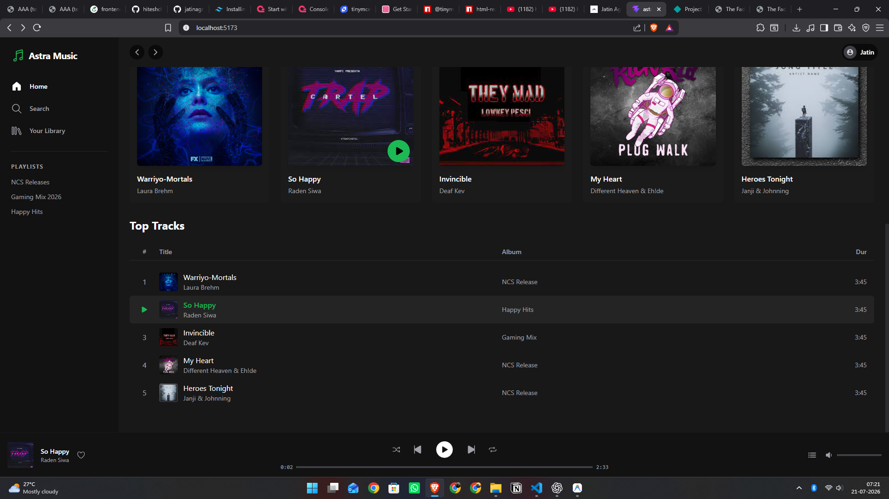
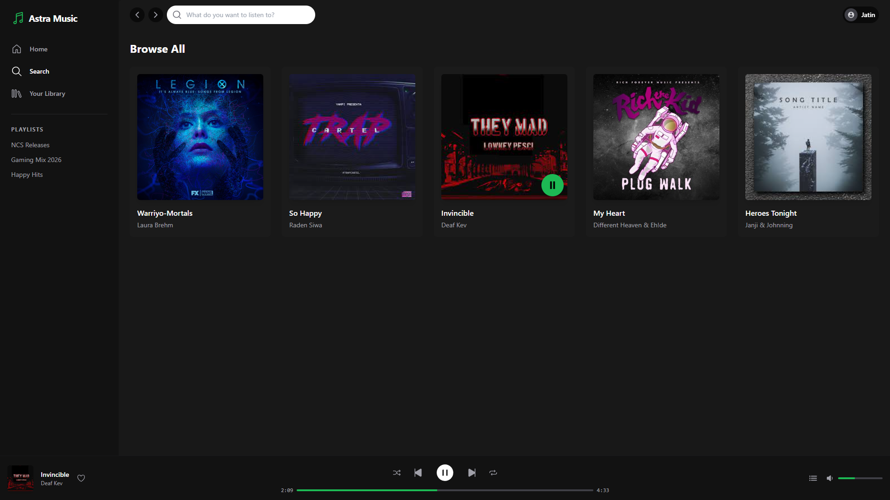
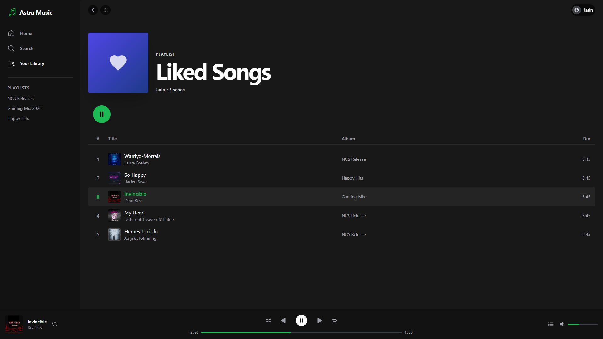
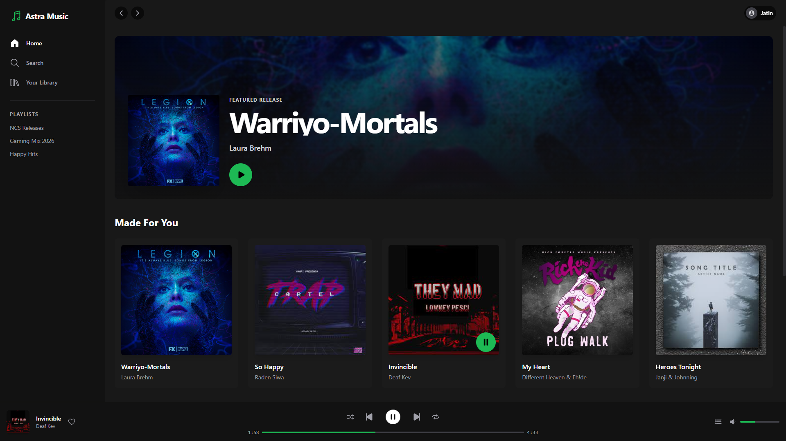

# Astra Music Player – Modern Web Audio Player

Astra Music Player is a premium, Spotify-inspired audio streaming interface built with React 19. It focuses on delivering a smooth, uninterrupted listening experience through global state management, responsive UI design, and high-performance routing. Designed with a sleek dark-mode aesthetic, the project demonstrates scalable component architecture for a robust media application.

## Project Preview

|                  Home Page                  |                  Search Page                   |
| :-----------------------------------------: | :--------------------------------------------: |
|     |      |
|              **Your Library**               |              **Player Controls**               |
|  |  |

## Live Demo

[Live Demo Link](#) _(Replace with deployed link)_

## Tech Stack

| Technology            | Description                         |
| :-------------------- | :---------------------------------- |
| **React 19**          | UI Library & Component Architecture |
| **Vite**              | Fast Build Tool & Bundler           |
| **Tailwind CSS**      | Utility-First CSS Framework         |
| **React Router**      | Client-Side Routing                 |
| **Context API**       | Global Audio State Management       |
| **JavaScript (ES6+)** | Language                            |

## Features

- Persistent global audio player
- Play, pause, skip, and previous track controls
- Dynamic volume slider with mute toggling
- Interactive track seek bar
- Interactive track queueing
- Shuffle and repeat playback modes
- Mobile-first responsive design
- Clean, Spotify-inspired dark aesthetic
- Client-side routing for seamless page transitions

## Audio Data & Architecture

Audio metadata and file paths are handled through a central static data store, while the React Context API powers the media engine.

- Songs and metadata (title, artist, album art) are stored in a modular data file (`songs.js`).
- A hidden `<audio>` element is mounted at the root level inside `PlayerContext`.
- Real-time events like `timeupdate` and `ended` are listened to globally and mutate context state.
- Components subscribe to `usePlayer()` to access playback states anywhere in the DOM tree, avoiding prop drilling.
- The architecture cleanly separates the visual component layer from the audio logic engine.

## Project Highlights

This project is a modernized version of a vanilla HTML/JS music player, significantly upgraded for production quality.

- Complete UI/UX redesign and modernization
- Transition from vanilla DOM manipulation to declarative React patterns
- Replaced monolithic scripts with reusable modular components
- Custom range slider styling mimicking native player functionality
- Tailwind CSS implementation for scalable styling
- Enhanced user experience with micro-animations

## Author

**Jatin Agrahari**

- **Portfolio**: [jatinagrahari.com](#)
- **GitHub**: [github.com/jatinagrahari](#)
- **LinkedIn**: [linkedin.com/in/jatinagrahari](#)
